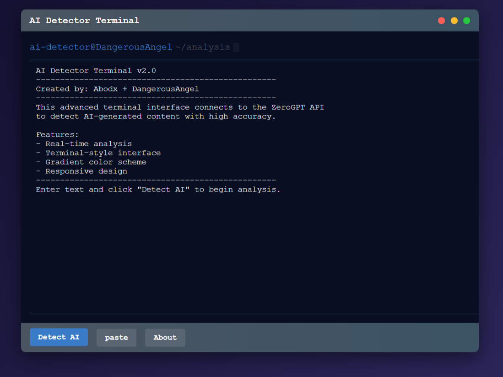

# AI Detector Terminal v2

A sleek, terminal-style web app that detects AI-generated text using the ZeroGPT API. 

## Features  

- 🌟 **Terminal-inspired UI** 
- 🔍 **AI Detection** via ZeroGPT API  
- ⌨️ **Keyboard shortcut** (Ctrl+Enter) for quick analysis  

## How to Use  

1. Paste your text into the terminal  
2. Click **"Detect AI"** or press **Ctrl+Enter**  
3. View the analysis results  

---  

Created by **Abodx + DangerousAngel**  
[Abodx](https://github.com/Abodx9/)  
[DangerousAngel](https://abodx9.github.io/DangerousAngel/)  

*Simply open the HTML file in any modern browser to use!* 🚀
